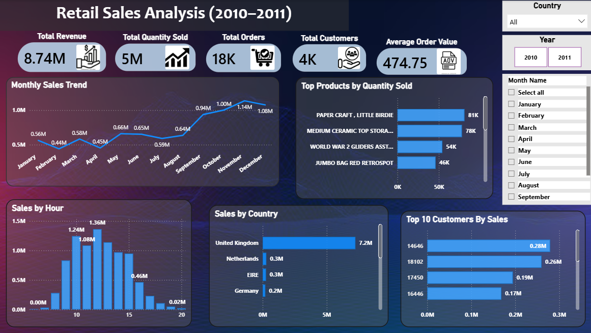

# Retail Sales Analysis (2010–2011)

## Project Overview

This project analyzes retail sales transactions from 2010–2011 to identify revenue trends, top-performing products, customer behavior, and country-wise sales performance.

The analysis was performed using Excel for data cleaning, SQL for business analysis, and Power BI for interactive dashboard creation.

---

## Business Objective

The objective of this project is to:

* Analyze overall sales performance
* Identify top-selling products
* Understand customer purchasing behavior
* Compare sales across countries
* Discover monthly and hourly sales trends
* Generate actionable business insights

---

## Tools Used

* Microsoft Excel
* SQL Server
* Power BI
* GitHub

---

## Data Cleaning (Excel)

The dataset was cleaned using Excel by:

* Removing duplicate records
* Handling missing values
* Standardizing data formats
* Creating calculated fields
* Preparing data for SQL analysis

---

## SQL Analysis

The following business questions were answered using SQL:

### KPI Analysis

* Total Revenue
* Average Order Value
* Total Orders
* Total Customers

### Product Analysis

* Top Selling Products
* Lowest Performing Products

### Country Analysis

* Top Countries by Revenue

### Time-Based Analysis

* Monthly Sales Trend
* Hourly Sales Pattern
* Day-wise Sales Pattern

### Customer Analysis

* Top Customers by Revenue
* Customer Purchase Frequency

### Business Insights

* Revenue Contribution Percentage by Country

---

## Power BI Dashboard

### Dashboard Features

* Revenue KPI Cards
* Monthly Sales Trend
* Top Products Analysis
* Country-wise Revenue Analysis
* Customer Analysis
* Hourly Sales Pattern
* Interactive Filters

## Dashboard Preview

---

## Key Insights

* Generated total revenue of 8.74M.
* Processed over 18K customer orders.
* Served approximately 4K customers.
* United Kingdom contributed the highest revenue.
* Paper Craft, Little Birdie was the top-selling product.
* Sales peaked during the final quarter of the year.
* Most transactions occurred during business hours.

---

## Project Files

* Excel Data Cleaning File
* SQL Analysis Queries
* Power BI Dashboard
* Dashboard Screenshots

---

## Conclusion

This project demonstrates an end-to-end retail sales analysis workflow using Excel, SQL, and Power BI. It highlights data cleaning, business analysis, dashboard development, and insight generation skills commonly required for Data Analyst roles.

